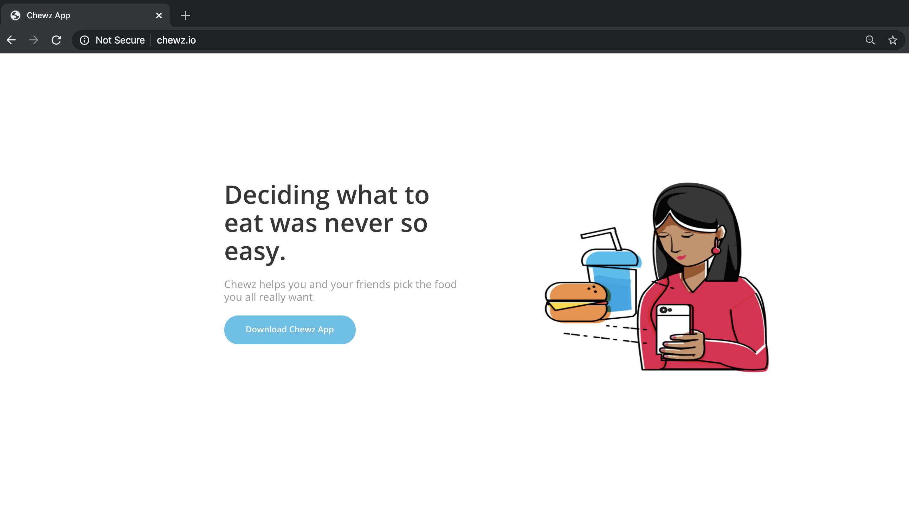
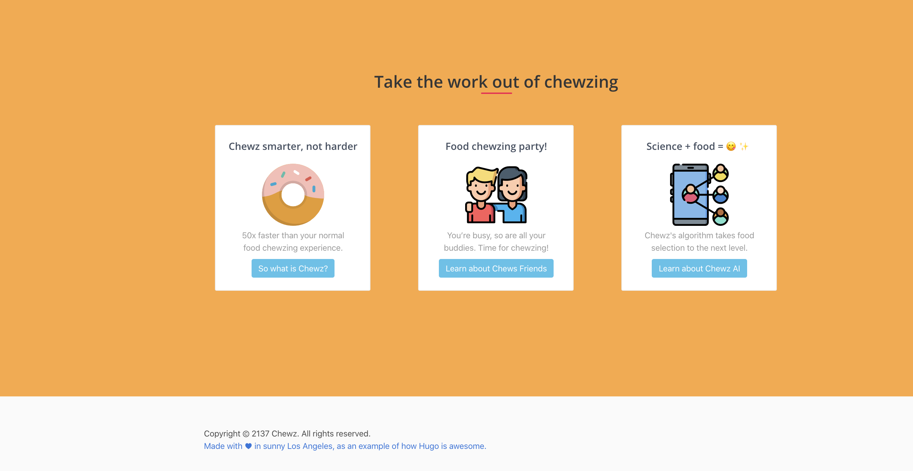

# 🦹🏽 Project II: An Food App Website


<p align="center">

  
</p>


You can run it locally (`localhost:1313`) with:

```
hugo server -D
```

Follow [these instructions](https://medium.com/python-for-the-utopian/deploying-websites-with-hugo-465dee88a295) to learn how to deploy it.

